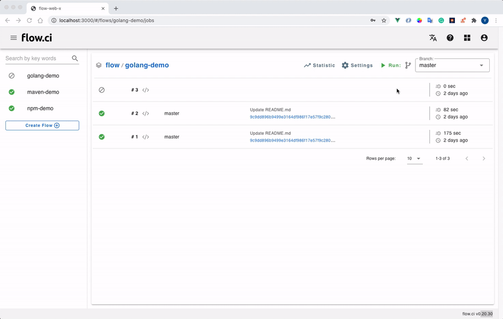

# Git Configuration

## 1. Clone Git Repo

flow.ci clone git repo by plugin [git clone](https://github.com/flowci-plugins/gitclone)

```yaml
steps:
- name: clone
  docker:
    image: flowci/debian-git ## other images with git command can be applied here as well
  plugin: 'gitclone'
```

You can config git repo url via both YAML and UI. The variable `FLOWCI_GIT_CREDENTIAL` must be defined if git url is based on SSH.

- YAML configuration

  ```yaml
  envs:
    FLOWCI_GIT_URL: "https://github.com/FlowCI/spring-petclinic-sample.git"
    # FLOWCI_GIT_CREDENTIAL: your_secret_name, created from secret from Admin Settings -> Secrets -> +
  ```

- Web UI configuration

  

## 2.Access Permission

The SSH-RSA `secret` is required if git url is ssh based, for example `git@github.com:FlowCI/docs.git`

1. Create SSH-RSA secret

   - Go to `Settings -> Secret -> +` from Admin page
   - Input a secret name, for example `ras-test`
   - Select `SSH key` category
   - Click `create a new` ssh key pair or paste exsiting public and private key
   - Save

    

2. Config secret in the flow

   `FLOWCI_GIT_CREDENTIAL` variable is applied for git access permisison in [Git clone plugin](https://github.com/flowci-plugins/gitclone), the value is secret name. For example:

   ```yaml
    envs:
      FLOWCI_GIT_CREDENTIAL: "rsa-test"

    steps:
    - name: clone
      docker:
        image: flowci/debian-git
      plugin: 'gitclone'
   ```

## 3. Config permission and event triger on Git repo

flow.ci currenlty supported git repo are:

- [GitHub](./github.md)
- [GitLab](./gitlab.md)
- [Gogs](./gogs.md)
- [Gitee](./gitee.md)

please click around the links for more detail
